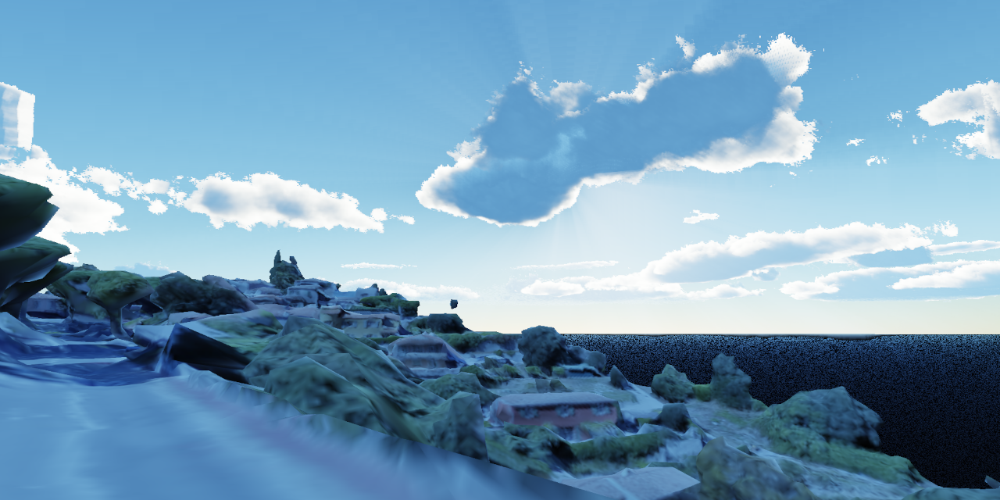
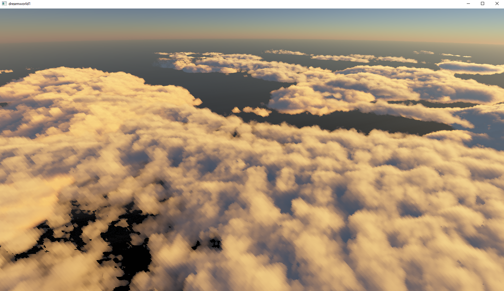
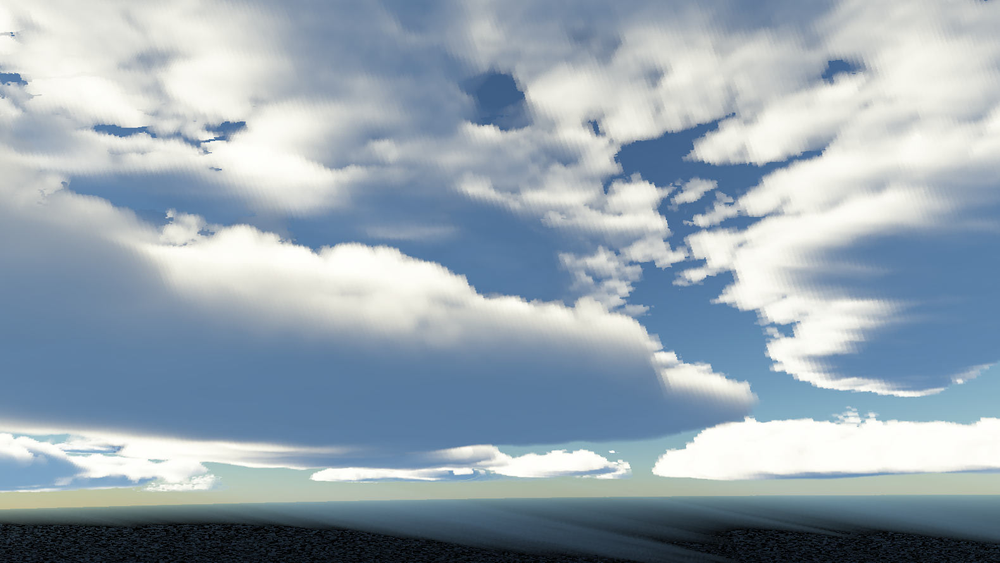

# First-time Lighting the World
origin is <Dream World 1, Volumetric Cloud>
Free-License

Sky,          50%
ShallowWater, 0%
Plant,        0%
Wind,         0%

......
.....
...
..
.
.
.
.
.
.
.
.
ignore....

Teams:
Probability: { 0 <= x <= 1 }

1. Lighting
  1.1 Transmittance-Equation
      Direct_radiance = Direct_radiance * Direct_energy * Direct_visibility;
      Indirect_radiance = Indirect_radiance * Indirect_energy * Indirect_visivility;
      Integrate(camera to endPoint){ transmittance(camera to thePoint) * (Direct_radiance + Indirect_radiance) * (- absorption - outscattering + inscattering) * phase(theta) * ds }
  
 
2. Cloud Shape
  2.1 Schneider's Cloud-Model
    Shape = Function(coverage, height_coverage, details)
    
  2.2 Schneider's Source in 2015
    Cloud_density = remap(base_noise * height_coverage, 1.0 - coverage, 1.0) * coverage
    Cloud_density = rescale(Cloud_density，highfreq_noise)
    Cloud_density = rescale(Cloud_density，highhighfreq_noise)
    
    Important is <Remap idea>, and Remap(value, lower, upper, 0, 1) equal Rescale(value, lower, upper)
    I recommented first use noise and customized-image in 2D-Render
    
    Important is <Fraction idea>, added higher-and-higher frequency noise octive
    Can see <Real-time Volume Render> or <Texturing And Modeling>
  
  2.3 Other-Source in shadertoy by alro
    coverage * hight_coverage = Volume_Container_density
    Cloud_density = rescale(Volume_Container_density，noise)
    Cloud_density = rescale(Cloud_density，highfreq_noise)
    Cloud_density = rescale(Cloud_density，highhighfreq_noise)
    from "https://www.shadertoy.com/view/WscyWB", His great work
    
3. Raymarch
  3.1 Equal-Length-Raymarch
    Length ds = Constant;
    for(int i = 0; i != step; ++i){
      Length s = i * ds;
      ...
    }
       
    Simple method, by increment ds can avoid fault
       
  3.2 Detail-Raymarch
    Length step_length = Constant;
    Length detail_length = small_length;
    bool State = Normal;
    for(int i = 0; i != step; ++i){
      if(State == Detail){
        ...
        Length ds = detail_length;
      } else {
        Length ds = step_length;
        ...
        if(...){
          State = Detail;
        }
      }
    }
       
    More detail results
   
  3.3 Empty-Space-Raymarch
    Length init_step_length = setup(detail_length, n);
    for(int i = 0; i != step; ++i){
      Length ds = pow(0.5,n)*init_step_length;
      ...
    }
      
    Close camera Objects must are very large and continuous
   
  3.4 Structed-Raymarch
    setup(t, dt, wt);
    for(int i = 0; i != step; ++i){
      ds = wt*dt;
          
      ...
      t += dt; // cannot use i * dt
    }
       
    Avoid fault
       
       
I believe you don't need to look at Source after reading this README
